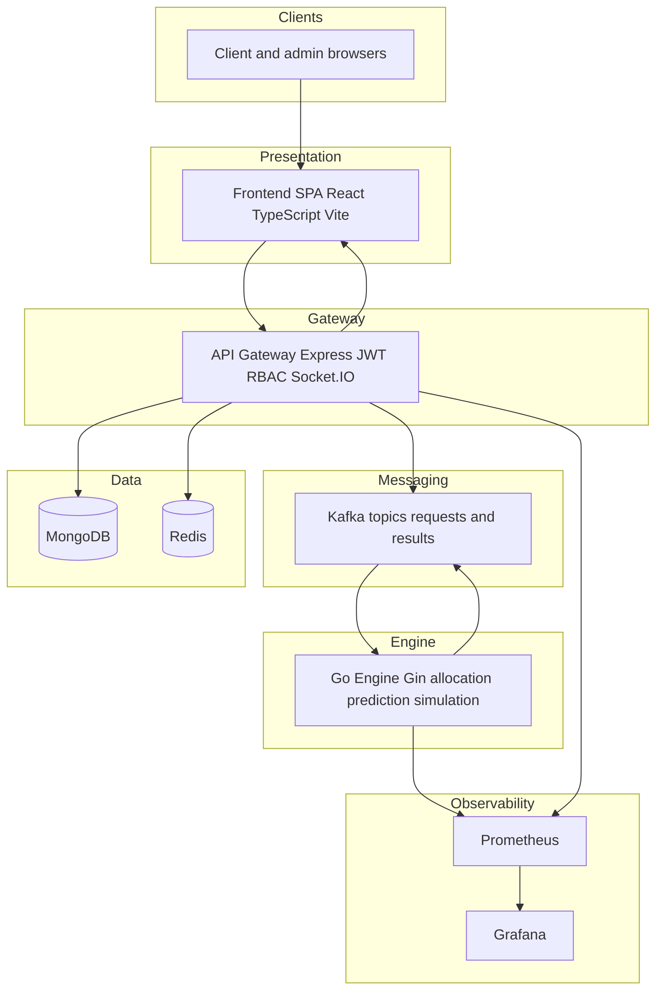

# Schedulord — Enterprise Resource Orchestration Platform


Schedulord is a distributed platform for **controlled, auditable allocation** of compute-style resources. Clients submit requests; administrators review them with AI-assisted prediction and simulation; approved work flows through Kafka-backed processing and persists in MongoDB, with Redis-backed caching on hot paths and Prometheus/Grafana for operations visibility.

---

## Table of Contents

1. [Security and public repositories](#security-and-public-repositories)
2. [Repository structure](#repository-structure)
3. [Project overview](#project-overview)
4. [System architecture](#system-architecture)
5. [Tech stack](#tech-stack)
6. [AI and ML pipeline](#ai-and-ml-pipeline)
7. [User roles and permissions](#user-roles-and-permissions)
8. [API endpoints](#api-endpoints)
9. [Database schema (collections)](#database-schema-collections)
10. [Bootstrap admin and demo client](#bootstrap-admin-and-demo-client)
11. [Frontend application routes](#frontend-application-routes)
12. [Docker Compose services and ports](#docker-compose-services-and-ports)
13. [Configuration and environment variables](#configuration-and-environment-variables)
14. [Live links and port matrix](#live-links-and-port-matrix)
15. [Quick start](#quick-start)
16. [Production readiness checklist](#production-readiness-checklist)

---

## Security and public repositories

**Do not commit secrets to GitHub** (or any public remote). This includes:

- MongoDB connection strings and database passwords  
- JWT signing secrets  
- Bootstrap admin passwords  
- Grafana administrator passwords  
- API keys, TLS private keys, or production URLs tied to internal infrastructure  

Use environment variables and a secrets manager in production. For Docker Compose, copy `env.docker.example` to a root `.env` file (which must remain untracked), fill in values locally, and never push that file. The API Gateway and frontend also ship `.env.example` files under their respective directories for non-Docker workflows.

If credentials were ever committed, **rotate them immediately** in the provider (Atlas, IdP, etc.) and treat the old values as compromised.

---

## Repository structure

High-level layout of this monorepo (excluding `node_modules`, build artifacts, and local tooling):

```text
.
├── docker/                          # Container build contexts and helper configs
│   ├── frontend.Dockerfile
│   ├── go.Dockerfile
│   ├── grafana.Dockerfile
│   ├── node.Dockerfile             # API Gateway image
│   ├── prometheus.Dockerfile
│   └── nginx.conf
├── docker-compose.yml               # Full stack (Kafka, Redis, gateway, engine, UI, metrics)
├── env.docker.example               # Template for root `.env` used by Docker Compose
├── schedulord_research_dataset_12000.csv
├── frontend/                        # React (Vite) SPA
│   ├── public/                     # Static assets (e.g. GLB model, icons)
│   ├── src/
│   │   ├── components/             # Shared UI (layout, 3D display, charts)
│   │   ├── pages/                  # Route-level screens (admin, client, landing)
│   │   ├── store/                  # Redux slices and store setup
│   │   ├── api.ts                  # Authenticated HTTP client
│   │   ├── socket.ts               # Realtime client wiring
│   │   ├── App.tsx
│   │   ├── main.tsx
│   │   └── index.css
│   ├── index.html
│   ├── vite.config.ts
│   ├── tsconfig.json
│   └── package.json
├── backend/
│   ├── api-gateway/                # Node.js Express service (JWT, REST, WebSockets, Kafka producer/consumer)
│   │   └── src/
│   │       ├── app.js              # Application bootstrap
│   │       ├── config/             # db, redis, kafka, env loading
│   │       ├── controllers/        # auth, users, resources, requests, analytics
│   │       ├── middleware/         # auth JWT/RBAC, error handling
│   │       ├── models/             # Mongoose schemas (User, Resource, Request, etc.)
│   │       ├── routes/             # HTTP route modules
│   │       ├── services/           # goClient, request processor, Kafka consumer
│   │       ├── sockets/            # Socket.IO server integration
│   │       ├── metrics/            # Prometheus instrumentation
│   │       └── utils/              # logging, seed helpers
│   ├── go-engine/                  # Go service: allocation, prediction, simulation, Kafka
│   │   ├── cmd/
│   │   │   ├── main.go             # Service entrypoint
│   │   │   └── scenario_eval/      # Scenario evaluation utility
│   │   ├── api/
│   │   │   └── routes.go           # HTTP route registration (Gin)
│   │   ├── internal/
│   │   │   ├── aisupport/          # Hybrid ML helpers (training/inference hooks)
│   │   │   ├── allocation/
│   │   │   ├── conflict/
│   │   │   ├── engine/
│   │   │   ├── handlers/
│   │   │   ├── kafka/
│   │   │   ├── learning/
│   │   │   ├── metrics/
│   │   │   ├── models/
│   │   │   ├── prediction/
│   │   │   └── simulation/
│   │   ├── pkg/
│   │   │   └── logger.go
│   │   ├── go.mod
│   │   └── go.sum
│   ├── kafka/                      # Kafka-related docs or helpers
│   └── monitoring/                 # Prometheus scrape config, Grafana dashboards, alert rules
│       ├── grafana/
│       ├── prometheus/
│       └── alerts/
├── LICENSE
├── package.json                    # Optional workspace/root scripts (if used)
└── README.md
```

---

## Project overview

Schedulord targets teams that need **policy-aligned resource assignment** with transparency and automation assistance.

**Typical workflow**

1. A client authenticates and submits a resource request (type, quantity, priority, reviewer).
2. The request appears in an administrator queue.
3. Administrators use dashboard analytics and AI-backed prediction/simulation (via the Go engine) to inform approve/reject decisions.
4. Approved requests enter the asynchronous pipeline (Kafka); the Go engine participates in allocation and outcome computation.
5. Results and events are stored and surfaced in the UI; metrics flow to Prometheus/Grafana.

**Design themes**

- JWT-based authentication with role separation (`user` vs `admin`).
- Event-driven decoupling between the API Gateway and engine where Kafka is enabled.
- Defensive API behavior: gateways may proxy analytics with degraded/fallback payloads when upstream components are stressed (see gateway and frontend client code).

---

## Frontend application routes

The SPA is built with React Router. Unauthenticated visitors hitting protected paths are redirected to **`/`** (landing).

| Path | Who | Purpose |
|------|-----|---------|
| `/` | Public | Landing page (marketing hero, 3D asset when configured). |
| `/login/admin` | Public | Admin sign-in (`intendedRole`: `admin`). |
| `/login/client` | Public | Client sign-in and registration (`intendedRole`: `user`). |
| `/panel/dashboard` | Signed-in | Role-specific dashboard. |
| `/panel/resources` | Signed-in | Browse resources (client-oriented view). |
| `/panel/admin-resources` | Admin only | Resource administration. |
| `/panel/requests` | Signed-in | Request list and lifecycle actions (scoped by role). |
| `/panel/decisions` | Signed-in | Decision views for the authenticated user. |
| `/panel/admin-request-decisions` | Admin only | Queue/history for approve/reject with prediction context. |
| `/panel/analytics` | Signed-in | Analytics views per gateway permissions. |
| `/panel/admin-manage` | Admin only | User and platform management screens. |
| `/panel/monitoring` | Admin only | Grafana/Prometheus shortcuts when `VITE_*` URLs are set (see `frontend/.env.example`). |

**Local dev networking:** `frontend/vite.config.ts` runs the dev server on **port 3001** and proxies **`/api`** and **`/socket.io`** to **`http://localhost:8080`**. Run the API gateway on **`PORT=8080`** (see `backend/api-gateway/.env.example`) or change the Vite proxy target to match your gateway port.

---

## System architecture

### Logical flow (text)

```text
Browser (React + TypeScript)
       ↓ HTTPS / WSS
API Gateway (Node.js + Express + JWT/RBAC + Socket.IO)
       ↓                    ↘
   Kafka (topics)           MongoDB (persistent documents)
       ↓                    Redis (cache)
Go Engine (Go + Gin: allocation, prediction, simulation, Kafka)
       ↓
Prometheus ← scrape ← Gateway + Engine
       ↓
Grafana (dashboards)
```

### Rendered architecture diagram

No decorative symbols are used inside the diagram nodes so it stays suitable for documentation exports and PDFs.



---

## Tech stack

| Layer | Technologies |
|--------|----------------|
| Frontend | React 19, TypeScript, Vite, Tailwind CSS, Redux Toolkit, React Router, Recharts, Framer Motion, Three.js (`@react-three/fiber`, `@react-three/drei`), Socket.IO client |
| API Gateway | Node.js, Express, JWT, Joi/Zod validation, Mongoose, ioredis, KafkaJS, Socket.IO, Morgan/Pino, `prom-client` |
| Go Engine | Go, Gin, internal allocation/prediction/simulation packages, Kafka consumer/producer patterns, Prometheus metrics |
| Data | MongoDB (documents), Redis (cache) |
| Messaging | Kafka (+ Zookeeper in Compose) |
| Observability | Prometheus, Grafana |
| Packaging | Docker, Docker Compose |

---

## AI and ML pipeline

Implementation reference: `backend/go-engine/internal/aisupport` (supporting types, training hooks, and model orchestration). Training data included in-repo: `schedulord_research_dataset_12000.csv`.

**Stages (conceptual)**

1. **Feasibility / logistic-style scoring** — Estimates whether a request can be satisfied under current constraints.
2. **Tree / forest-style load estimation** — Approximates near-term pressure using request and system context features.
3. **Neural priority scoring** — Small feed-forward component contributing to composite ranking outputs.

**Libraries**

- `gorgonia.org/gorgonia`
- `gorgonia.org/tensor`

These provide tensor operations and graph execution suitable for the neural portions of the pipeline inside Go.

**API-visible outputs (typical fields)**

Fields such as `feasibilityScore`, `predictedLoad`, `priorityScore`, `aiScore`, `recommendationScore`, and structured `decisionLog` metadata may appear depending on route and engine version. Exact shapes should be validated against live OpenAPI documentation if you add it, or by inspecting gateway ↔ engine contracts in code.

**Operational note**

The engine is intended to initialize models from packaged data; misconfiguration or missing data should surface as startup errors rather than silent low-quality inference.

---

## User roles and permissions

Enforcement is implemented via JWT verification middleware and `requireRole(...)` guards on routes.

| Role | Capabilities (summary) |
|------|-------------------------|
| `user` | Authenticated client portal: create and manage own requests within rules, view dashboards scoped to allowed data, cancel eligible requests. |
| `admin` | All `user` capabilities plus user administration, resource CRUD, approve/reject workflow, manual allocation triggers, administrative analytics and maintenance routes where implemented. |

**HTTP semantics**

- `401` — Missing or invalid token.
- `403` — Authenticated but not authorized for the route or action.

---

## API endpoints

All REST routes below are mounted under **`/api`** on the gateway (see `backend/api-gateway/src/app.js`). Full URLs depend on host and **`PORT`** — see [Live links and port matrix](#live-links-and-port-matrix). Examples: `http://localhost:8080/api/...` (local Vite + gateway default) or `http://localhost:8081/api/...` (Docker Compose).

### Health and metrics

| Method | Path | Auth | Description |
|--------|------|------|-------------|
| GET | `/health` (outside `/api`) | No | Liveness-style gateway health |
| GET | `/metrics` (outside `/api`) | No | Prometheus scrape endpoint |

### Authentication

| Method | Path | Auth | Description |
|--------|------|------|-------------|
| POST | `/auth/register` | No | Register a client user |
| POST | `/auth/login` | No | Login; gateway expects intended role per implementation |

### Users

| Method | Path | Auth | Role | Description |
|--------|------|------|------|-------------|
| GET | `/users/me` | Yes | user/admin | Current profile |
| GET | `/users/admins` | Yes | user/admin | List admins usable as reviewers |
| GET | `/users` | Yes | admin | List users |
| POST | `/users` | Yes | admin | Create user |
| PATCH | `/users/:id` | Yes | admin | Update user |

### Resources

| Method | Path | Auth | Role | Description |
|--------|------|------|------|-------------|
| GET | `/resources` | Yes | user/admin | List resources |
| GET | `/resources/:id` | Yes | user/admin | Detail |
| POST | `/resources` | Yes | admin | Create |
| PATCH | `/resources/:id` | Yes | admin | Update |
| DELETE | `/resources/:id` | Yes | admin | Delete |

### Requests

| Method | Path | Auth | Role | Description |
|--------|------|------|------|-------------|
| GET | `/requests` | Yes | user/admin | List (scoped by role) |
| GET | `/requests/decisions/me` | Yes | admin | Admin decision views |
| GET | `/requests/:id` | Yes | user/admin | Detail |
| POST | `/requests` | Yes | user | Create |
| POST | `/requests/:id/cancel` | Yes | user/admin | Cancel |
| POST | `/requests/:id/allocate` | Yes | admin | Manual allocation |
| POST | `/requests/:id/approve` | Yes | admin | Approve |
| POST | `/requests/:id/reject` | Yes | admin | Reject |
| POST | `/requests/clear` | Yes | admin | Administrative clear utility |

### Analytics

| Method | Path | Auth | Role | Description |
|--------|------|------|------|-------------|
| GET | `/analytics/dashboard` | Yes | user/admin | Aggregated dashboard metrics |
| GET | `/analytics/utilization` | Yes | user/admin | Utilization |
| GET | `/analytics/demand-trends` | Yes | admin | Demand trends |
| GET | `/analytics/allocations` | Yes | user/admin | Allocation metrics |
| GET | `/analytics/events` | Yes | user/admin | Event feed |
| GET | `/analytics/predict` | Yes | user/admin | Prediction proxy to engine |
| GET | `/analytics/simulate` | Yes | user/admin | Simulation proxy |
| GET | `/analytics/engine-health` | Yes | admin | Engine health via gateway |

### Go Engine (direct HTTP)

When running locally outside Docker, the engine port may differ from Compose defaults; configure `GO_ENGINE_BASE_URL` / `GO_ENGINE_BASE_URLS` on the gateway accordingly.

| Method | Path | Description |
|--------|------|-------------|
| GET | `/healthz` | Health |
| POST | `/process` | Process allocation payload |
| GET | `/predict` | Prediction |
| GET | `/simulate` | Simulation |
| GET | `/learning/stats` | Learning statistics |
| GET | `/metrics` | Prometheus metrics |

---

## Database schema (collections)

### `users`

- `name`, `email` (unique, indexed), `passwordHash`, `role` (`admin` \| `user`), `isActive`, timestamps.

### `resources`

- `name`, `type`, `capacity`, `metadata`, `isAvailable`, timestamps; indexed fields as implemented in Mongoose schema.

### `requests`

- References: `userId`, `reviewerAdminId`, optional `preferredResourceId`.
- Fields: `resourceType`, `quantity`, `priority`, `status`, `reason`, approval flags, Kafka metadata, lease/idempotency fields — see `backend/api-gateway/src/models/Request.js` for authoritative indexes.

### `allocations`

- One primary allocation per request (`requestId` unique), `resourceId`, `decidedBy`, scoring fields, `strategy`, `alternatives`, `details`.

### `systemevents`

- Typed operational events with severity, optional foreign keys, TTL on `createdAt` (~30 days).

### `auditlogs`

- Actor, action, entity references, request metadata (`ip`, `userAgent`, `details`).

---

## Bootstrap admin and demo client

Set passwords only in **private** `.env` files (never commit them).

### Demo admin account

Treat it like a normal login — you choose the email and password in config:

| Field | You use |
|--------|---------|
| **Email** | The value of `BOOTSTRAP_ADMIN_EMAIL` in your `.env` |
| **Password** | The value of `BOOTSTRAP_ADMIN_PASSWORD` in your `.env` |

**Where to sign in:** **`/login/admin`** (after the frontend is running).

The gateway creates this admin **once** on first startup if that email does not exist yet. Sample resources are added if the DB is empty. Copy **`env.docker.example`** → **`.env`** and fill those two variables (plus other required vars for Compose).

> **Local tip:** If you run `npm run dev` without setting those variables, development defaults are applied from `backend/api-gateway/src/utils/seedData.js` — **localhost only**; set real values for Docker or any shared deploy.

Use **`/login/client`** for normal users, not the admin URL (otherwise login fails with a role mismatch).

#### Local quick demo (optional)

If you run the gateway **without** setting `BOOTSTRAP_ADMIN_EMAIL` and `BOOTSTRAP_ADMIN_PASSWORD`, `seedData.js` applies these **development-only** defaults on first start:

| Field | Default |
|--------|---------|
| **Email** | `admin@schedulord.local` |
| **Password** | `ChangeMe123!` |

Sign in at **`/login/admin`**. Replace these with your own `.env` values before Docker Compose, staging, production, or any internet-facing host.

### Demo client account

There is **no** built-in client user. Create one, then sign in at **`/login/client`**:

| Step | What to do |
|------|------------|
| **Register** | Use the form on `/login/client`, or `POST /api/auth/register` with `name`, `email`, `password`. |
| **Sign in** | Same email/password on `/login/client`, or `POST /api/auth/login` with `"intendedRole": "user"`. |

Example registration payload (use your own email/password):

```json
{ "name": "Demo Client", "email": "demo.client@example.com", "password": "YourSecurePassword" }
```

---

## Docker Compose services and ports

`docker-compose.yml` defines the following stack (service names are Compose keys). **Host ports** are what you open in a browser or curl from your machine; **internal** addresses are used between containers.

| Service | Host port(s) | Role |
|---------|----------------|------|
| `redis` | `6379` | Cache/session backing for the gateway (`REDIS_URL` inside Compose uses `redis://redis:6379`). |
| `zookeeper` | (none exposed) | Kafka dependency. |
| `kafka` | `9092` | Broker for host-side clients; containers use `kafka:29092`. |
| `go-engine` | `9090` | Go processing service; `GO_ENGINE_PORT=9090` in Compose. Gateway uses `GO_ENGINE_BASE_URL=http://go-engine:9090` by default. |
| `api-gateway` | `8081` | Express API + Socket.IO; `PORT=8081` in Compose. REST lives under `/api`. |
| `frontend` | `3001` → container `80` | Static SPA served via the frontend image (nginx inside container). |
| `prometheus` | `9091` → container `9090` | Scrapes gateway and engine metrics per `backend/monitoring/prometheus/prometheus.yml`. |
| `grafana` | `3000` | Dashboard UI; credentials from root `.env` (`GRAFANA_ADMIN_*`). |

Before `docker compose up`, create a root `.env` from `env.docker.example`. Compose **requires** non-empty values for: `MONGODB_URI`, `JWT_SECRET`, `BOOTSTRAP_ADMIN_PASSWORD`, and `GRAFANA_ADMIN_PASSWORD` (see substitution errors in `docker-compose.yml` if any are missing).

---

## Configuration and environment variables

### Files to copy or edit

| File | Purpose |
|------|---------|
| `env.docker.example` | Root template for Docker Compose secrets (`cp` → `.env`). |
| `docker-compose.yml` | Service topology, image builds, published ports. |
| `backend/api-gateway/.env.example` | Gateway variables for **local** runs (`npm run dev` in `backend/api-gateway`). |
| `frontend/.env.example` | Optional `VITE_GRAFANA_URL`, `VITE_PROMETHEUS_URL` for the Monitoring page. |
| `backend/monitoring/prometheus/prometheus.yml` | Prometheus scrape targets and intervals. |
| `backend/monitoring/grafana/provisioning/*` | Grafana datasources and dashboard provisioning. |

### API Gateway (`backend/api-gateway`) — common variables

| Variable | Role |
|----------|------|
| `PORT` | HTTP listen port (defaults to `8080` if unset; Compose sets `8081`). |
| `MONGODB_URI` | MongoDB connection string (required). |
| `JWT_SECRET` | Signing key for access tokens (required). |
| `JWT_EXPIRES_IN` | Token lifetime (default `1d`). |
| `GO_ENGINE_BASE_URL` | Primary Go engine HTTP base URL (required in `config/env.js`). |
| `GO_ENGINE_BASE_URLS` | Optional comma-separated list consumed by `goClient.js` for failover across instances. |
| `GO_ENGINE_TIMEOUT_MS`, `GO_ENGINE_RETRIES`, `GO_ENGINE_RETRY_DELAY_MS` | Outbound engine HTTP behavior. |
| `GO_ENGINE_HEALTH_TTL_MS`, `GO_ENGINE_CIRCUIT_OPEN_MS` | Health cache and circuit breaker tuning. |
| `KAFKA_BROKERS`, `KAFKA_CLIENT_ID` | Kafka producer/consumer bootstrap (comma-separated brokers supported). |
| `REDIS_URL` | Redis connection URI. |
| `CORS_ORIGIN` | Allowed browser origin(s); tighten beyond `*` in production. |
| `BOOTSTRAP_ADMIN_EMAIL`, `BOOTSTRAP_ADMIN_PASSWORD` | Optional first admin seed (`ensureBootstrapData`). |
| `REQUEST_PROCESSOR_*` | Polling, batch size, and lease duration for the async request worker. |
| `USE_FALLBACK_ON_AI_FAILURE` | When enabled, gateway-side fallback behavior if the Go engine is unavailable (see gateway services). |
| `API_RATE_LIMIT_PER_MIN`, `API_READ_RATE_LIMIT_PER_MIN` | Optional overrides for Express rate limiting (`src/app.js`). |

### Go Engine (`backend/go-engine`)

| Variable | Role |
|----------|------|
| `GO_ENGINE_PORT` | Listen port (`9090` in Compose; **`9095` default** when unset for local `go run` — align gateway `GO_ENGINE_BASE_URL` accordingly). |
| `GO_ENGINE_WORKERS` | Worker count inside Compose build. |
| `KAFKA_BROKERS` | Broker list for engine Kafka integration (Compose uses `kafka:29092`). |

---

## Live links and port matrix

Use this matrix to avoid mixing **Compose** vs **local npm/go** ports.

| Mode | Frontend | API Gateway (`/api`, `/socket.io`) | Go Engine HTTP |
|------|-----------|-------------------------------------|----------------|
| Docker Compose | http://localhost:3001 | http://localhost:8081 | http://localhost:9090 |
| Local dev (default tooling) | http://localhost:3001 (Vite) | http://localhost:8080 (match Vite proxy) | http://localhost:9095 (`GO_ENGINE_PORT` default in code when unset) |

**Additional local endpoints**

| Service | Typical URL |
|---------|-------------|
| Gateway health | `http://<gateway-host>:<port>/health` |
| Gateway metrics | `http://<gateway-host>:<port>/metrics` |
| Kafka (host) | `localhost:9092` when Compose broker port is published |
| Redis (host) | `localhost:6379` when Redis port is published |
| Grafana (Compose) | http://localhost:3000 |
| Prometheus UI (Compose host map) | http://localhost:9091 |

Replace hosts with your deployment DNS names and TLS endpoints in production. **Do not embed production URLs or credentials in this repository.**

---

## Quick start

**Docker Compose (after root `.env` is filled in):**

```bash
cp env.docker.example .env
# Edit .env: MONGODB_URI, JWT_SECRET, BOOTSTRAP_ADMIN_PASSWORD, GRAFANA_ADMIN_PASSWORD (never commit .env)
docker compose up --build
```

**Manual development (three terminals):**

1. Start MongoDB, Redis, and Kafka reachable from your machine (for example local installs or a subset of Compose services).
2. Configure `backend/api-gateway/.env` — ensure **`GO_ENGINE_BASE_URL`** points at your running engine (typically **`http://localhost:9095`** for `go run`).
3. Run services:

```bash
cd frontend && npm install && npm run dev
cd backend/api-gateway && npm install && npm run dev
cd backend/go-engine && go run ./cmd/main.go
```

The Vite dev server proxies API traffic to **`http://localhost:8080`**; keep **`PORT=8080`** on the gateway or update **`frontend/vite.config.ts`**.

---

## Production readiness checklist

- [ ] No secrets in Git history for public remotes; `.env` untracked; rotated any leaked credentials.
- [ ] Frontend production build succeeds (`npm run build`).
- [ ] API Gateway lint clean (`npm run lint` in `backend/api-gateway`).
- [ ] Go engine `/healthz` and `/metrics` healthy behind your chosen port and firewall rules.
- [ ] JWT secret strength and rotation policy defined.
- [ ] MongoDB network access restricted (IP allowlists or private networking).
- [ ] Kafka and Redis secured (auth/TLS) when exposed beyond localhost.
- [ ] CORS narrowed from `*` to trusted frontend origins.
- [ ] Prediction and simulation routes return expected payloads under load.
- [ ] Prometheus targets UP; Grafana dashboards validated.
- [ ] Bootstrap and Grafana passwords changed from any temporary development values.

---

Schedulord is intended as a reference architecture for intelligent scheduling workflows; adapt names, domains, and infrastructure boundaries to your organization’s standards.
