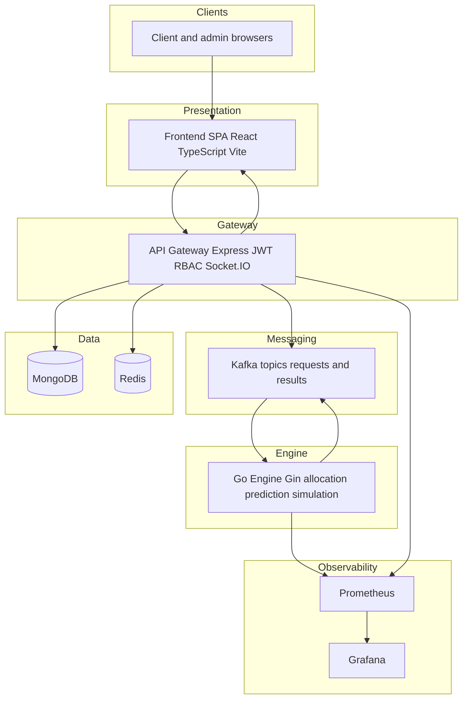

# Schedulord — Enterprise Resource Orchestration Platform


Schedulord is a distributed platform for **controlled, auditable allocation** of compute-style resources. Clients submit requests; administrators review them with AI-assisted prediction and simulation; approved work flows through Kafka-backed processing and persists in MongoDB, with Redis-backed caching on hot paths and Prometheus/Grafana for operations visibility.

---

## Table of Contents

1. [Security and public repositories](#security-and-public-repositories)
2. [Repository structure](#repository-structure)
3. [Project overview](#project-overview)
4. [System architecture](#system-architecture)
5. [Tech stack](#tech-stack)
6. [AI and ML pipeline](#ai-and-ml-pipeline)
7. [User roles and permissions](#user-roles-and-permissions)
8. [API endpoints](#api-endpoints)
9. [Database schema (collections)](#database-schema-collections)
10. [Bootstrap and local accounts](#bootstrap-and-local-accounts)
11. [Configuration files](#configuration-files)
12. [Live links (local defaults)](#live-links-local-defaults)
13. [Quick start](#quick-start)
14. [Production readiness checklist](#production-readiness-checklist)

---

## Security and public repositories

**Do not commit secrets to GitHub** (or any public remote). This includes:

- MongoDB connection strings and database passwords  
- JWT signing secrets  
- Bootstrap admin passwords  
- Grafana administrator passwords  
- API keys, TLS private keys, or production URLs tied to internal infrastructure  

Use environment variables and a secrets manager in production. For Docker Compose, copy `env.docker.example` to a root `.env` file (which must remain untracked), fill in values locally, and never push that file. The API Gateway and frontend also ship `.env.example` files under their respective directories for non-Docker workflows.

If credentials were ever committed, **rotate them immediately** in the provider (Atlas, IdP, etc.) and treat the old values as compromised.

---

## Repository structure

High-level layout of this monorepo (excluding `node_modules`, build artifacts, and local tooling):

```text
.
├── docker/                          # Container build contexts and helper configs
│   ├── frontend.Dockerfile
│   ├── go.Dockerfile
│   ├── grafana.Dockerfile
│   ├── node.Dockerfile             # API Gateway image
│   ├── prometheus.Dockerfile
│   └── nginx.conf
├── docker-compose.yml               # Full stack (Kafka, Redis, gateway, engine, UI, metrics)
├── env.docker.example               # Template for root `.env` used by Docker Compose
├── schedulord_research_dataset_12000.csv
├── frontend/                        # React (Vite) SPA
│   ├── public/                     # Static assets (e.g. GLB model, icons)
│   ├── src/
│   │   ├── components/             # Shared UI (layout, 3D display, charts)
│   │   ├── pages/                  # Route-level screens (admin, client, landing)
│   │   ├── store/                  # Redux slices and store setup
│   │   ├── api.ts                  # Authenticated HTTP client
│   │   ├── socket.ts               # Realtime client wiring
│   │   ├── App.tsx
│   │   ├── main.tsx
│   │   └── index.css
│   ├── index.html
│   ├── vite.config.ts
│   ├── tsconfig.json
│   └── package.json
├── backend/
│   ├── api-gateway/                # Node.js Express service (JWT, REST, WebSockets, Kafka producer/consumer)
│   │   └── src/
│   │       ├── app.js              # Application bootstrap
│   │       ├── config/             # db, redis, kafka, env loading
│   │       ├── controllers/        # auth, users, resources, requests, analytics
│   │       ├── middleware/         # auth JWT/RBAC, error handling
│   │       ├── models/             # Mongoose schemas (User, Resource, Request, etc.)
│   │       ├── routes/             # HTTP route modules
│   │       ├── services/           # goClient, request processor, Kafka consumer
│   │       ├── sockets/            # Socket.IO server integration
│   │       ├── metrics/            # Prometheus instrumentation
│   │       └── utils/              # logging, seed helpers
│   ├── go-engine/                  # Go service: allocation, prediction, simulation, Kafka
│   │   ├── cmd/
│   │   │   ├── main.go             # Service entrypoint
│   │   │   └── scenario_eval/      # Scenario evaluation utility
│   │   ├── api/
│   │   │   └── routes.go           # HTTP route registration (Gin)
│   │   ├── internal/
│   │   │   ├── aisupport/          # Hybrid ML helpers (training/inference hooks)
│   │   │   ├── allocation/
│   │   │   ├── conflict/
│   │   │   ├── engine/
│   │   │   ├── handlers/
│   │   │   ├── kafka/
│   │   │   ├── learning/
│   │   │   ├── metrics/
│   │   │   ├── models/
│   │   │   ├── prediction/
│   │   │   └── simulation/
│   │   ├── pkg/
│   │   │   └── logger.go
│   │   ├── go.mod
│   │   └── go.sum
│   ├── kafka/                      # Kafka-related docs or helpers
│   └── monitoring/                 # Prometheus scrape config, Grafana dashboards, alert rules
│       ├── grafana/
│       ├── prometheus/
│       └── alerts/
├── LICENSE
├── package.json                    # Optional workspace/root scripts (if used)
└── README.md
```

---

## Project overview

Schedulord targets teams that need **policy-aligned resource assignment** with transparency and automation assistance.

**Typical workflow**

1. A client authenticates and submits a resource request (type, quantity, priority, reviewer).
2. The request appears in an administrator queue.
3. Administrators use dashboard analytics and AI-backed prediction/simulation (via the Go engine) to inform approve/reject decisions.
4. Approved requests enter the asynchronous pipeline (Kafka); the Go engine participates in allocation and outcome computation.
5. Results and events are stored and surfaced in the UI; metrics flow to Prometheus/Grafana.

**Design themes**

- JWT-based authentication with role separation (`user` vs `admin`).
- Event-driven decoupling between the API Gateway and engine where Kafka is enabled.
- Defensive API behavior: gateways may proxy analytics with degraded/fallback payloads when upstream components are stressed (see gateway and frontend client code).

---

## System architecture

### Logical flow (text)

```text
Browser (React + TypeScript)
       ↓ HTTPS / WSS
API Gateway (Node.js + Express + JWT/RBAC + Socket.IO)
       ↓                    ↘
   Kafka (topics)           MongoDB (persistent documents)
       ↓                    Redis (cache)
Go Engine (Go + Gin: allocation, prediction, simulation, Kafka)
       ↓
Prometheus ← scrape ← Gateway + Engine
       ↓
Grafana (dashboards)
```

### Rendered architecture diagram

No decorative symbols are used inside the diagram nodes so it stays suitable for documentation exports and PDFs.



---

## Tech stack

| Layer | Technologies |
|--------|----------------|
| Frontend | React 19, TypeScript, Vite, Tailwind CSS, Redux Toolkit, React Router, Recharts, Framer Motion, Three.js (`@react-three/fiber`, `@react-three/drei`), Socket.IO client |
| API Gateway | Node.js, Express, JWT, Joi/Zod validation, Mongoose, ioredis, KafkaJS, Socket.IO, Morgan/Pino, `prom-client` |
| Go Engine | Go, Gin, internal allocation/prediction/simulation packages, Kafka consumer/producer patterns, Prometheus metrics |
| Data | MongoDB (documents), Redis (cache) |
| Messaging | Kafka (+ Zookeeper in Compose) |
| Observability | Prometheus, Grafana |
| Packaging | Docker, Docker Compose |

---

## AI and ML pipeline

Implementation reference: `backend/go-engine/internal/aisupport` (supporting types, training hooks, and model orchestration). Training data included in-repo: `schedulord_research_dataset_12000.csv`.

**Stages (conceptual)**

1. **Feasibility / logistic-style scoring** — Estimates whether a request can be satisfied under current constraints.
2. **Tree / forest-style load estimation** — Approximates near-term pressure using request and system context features.
3. **Neural priority scoring** — Small feed-forward component contributing to composite ranking outputs.

**Libraries**

- `gorgonia.org/gorgonia`
- `gorgonia.org/tensor`

These provide tensor operations and graph execution suitable for the neural portions of the pipeline inside Go.

**API-visible outputs (typical fields)**

Fields such as `feasibilityScore`, `predictedLoad`, `priorityScore`, `aiScore`, `recommendationScore`, and structured `decisionLog` metadata may appear depending on route and engine version. Exact shapes should be validated against live OpenAPI documentation if you add it, or by inspecting gateway ↔ engine contracts in code.

**Operational note**

The engine is intended to initialize models from packaged data; misconfiguration or missing data should surface as startup errors rather than silent low-quality inference.

---

## User roles and permissions

Enforcement is implemented via JWT verification middleware and `requireRole(...)` guards on routes.

| Role | Capabilities (summary) |
|------|-------------------------|
| `user` | Authenticated client portal: create and manage own requests within rules, view dashboards scoped to allowed data, cancel eligible requests. |
| `admin` | All `user` capabilities plus user administration, resource CRUD, approve/reject workflow, manual allocation triggers, administrative analytics and maintenance routes where implemented. |

**HTTP semantics**

- `401` — Missing or invalid token.
- `403` — Authenticated but not authorized for the route or action.

---

## API endpoints

**Gateway base path (development):** `http://localhost:8080/api` when running the gateway on port 8080, or `http://localhost:8081/api` when using the default Compose mapping — confirm the `PORT` environment variable for your run.

### Health and metrics

| Method | Path | Auth | Description |
|--------|------|------|-------------|
| GET | `/health` (outside `/api`) | No | Liveness-style gateway health |
| GET | `/metrics` (outside `/api`) | No | Prometheus scrape endpoint |

### Authentication

| Method | Path | Auth | Description |
|--------|------|------|-------------|
| POST | `/auth/register` | No | Register a client user |
| POST | `/auth/login` | No | Login; gateway expects intended role per implementation |

### Users

| Method | Path | Auth | Role | Description |
|--------|------|------|------|-------------|
| GET | `/users/me` | Yes | user/admin | Current profile |
| GET | `/users/admins` | Yes | user/admin | List admins usable as reviewers |
| GET | `/users` | Yes | admin | List users |
| POST | `/users` | Yes | admin | Create user |
| PATCH | `/users/:id` | Yes | admin | Update user |

### Resources

| Method | Path | Auth | Role | Description |
|--------|------|------|------|-------------|
| GET | `/resources` | Yes | user/admin | List resources |
| GET | `/resources/:id` | Yes | user/admin | Detail |
| POST | `/resources` | Yes | admin | Create |
| PATCH | `/resources/:id` | Yes | admin | Update |
| DELETE | `/resources/:id` | Yes | admin | Delete |

### Requests

| Method | Path | Auth | Role | Description |
|--------|------|------|------|-------------|
| GET | `/requests` | Yes | user/admin | List (scoped by role) |
| GET | `/requests/decisions/me` | Yes | admin | Admin decision views |
| GET | `/requests/:id` | Yes | user/admin | Detail |
| POST | `/requests` | Yes | user | Create |
| POST | `/requests/:id/cancel` | Yes | user/admin | Cancel |
| POST | `/requests/:id/allocate` | Yes | admin | Manual allocation |
| POST | `/requests/:id/approve` | Yes | admin | Approve |
| POST | `/requests/:id/reject` | Yes | admin | Reject |
| POST | `/requests/clear` | Yes | admin | Administrative clear utility |

### Analytics

| Method | Path | Auth | Role | Description |
|--------|------|------|------|-------------|
| GET | `/analytics/dashboard` | Yes | user/admin | Aggregated dashboard metrics |
| GET | `/analytics/utilization` | Yes | user/admin | Utilization |
| GET | `/analytics/demand-trends` | Yes | admin | Demand trends |
| GET | `/analytics/allocations` | Yes | user/admin | Allocation metrics |
| GET | `/analytics/events` | Yes | user/admin | Event feed |
| GET | `/analytics/predict` | Yes | user/admin | Prediction proxy to engine |
| GET | `/analytics/simulate` | Yes | user/admin | Simulation proxy |
| GET | `/analytics/engine-health` | Yes | admin | Engine health via gateway |

### Go Engine (direct HTTP)

When running locally outside Docker, the engine port may differ from Compose defaults; configure `GO_ENGINE_BASE_URL` / `GO_ENGINE_BASE_URLS` on the gateway accordingly.

| Method | Path | Description |
|--------|------|-------------|
| GET | `/healthz` | Health |
| POST | `/process` | Process allocation payload |
| GET | `/predict` | Prediction |
| GET | `/simulate` | Simulation |
| GET | `/learning/stats` | Learning statistics |
| GET | `/metrics` | Prometheus metrics |

---

## Database schema (collections)

### `users`

- `name`, `email` (unique, indexed), `passwordHash`, `role` (`admin` \| `user`), `isActive`, timestamps.

### `resources`

- `name`, `type`, `capacity`, `metadata`, `isAvailable`, timestamps; indexed fields as implemented in Mongoose schema.

### `requests`

- References: `userId`, `reviewerAdminId`, optional `preferredResourceId`.
- Fields: `resourceType`, `quantity`, `priority`, `status`, `reason`, approval flags, Kafka metadata, lease/idempotency fields — see `backend/api-gateway/src/models/Request.js` for authoritative indexes.

### `allocations`

- One primary allocation per request (`requestId` unique), `resourceId`, `decidedBy`, scoring fields, `strategy`, `alternatives`, `details`.

### `systemevents`

- Typed operational events with severity, optional foreign keys, TTL on `createdAt` (~30 days).

### `auditlogs`

- Actor, action, entity references, request metadata (`ip`, `userAgent`, `details`).

---

## Bootstrap and local accounts

On first startup the gateway can ensure an administrator exists using **environment-provided** bootstrap variables (names mirror `env.docker.example` and `backend/api-gateway/.env.example`). **Do not publish real emails or passwords** in README or issues; set them only in private `.env` files or your secrets manager.

Standard clients are created through `POST /api/auth/register` or admin-user provisioning routes, depending on your deployment policy.

---

## Configuration files

| File | Purpose |
|------|---------|
| `env.docker.example` | Root template for Docker Compose secrets and overrides |
| `docker-compose.yml` | Service topology and ports |
| `backend/api-gateway/.env.example` | Gateway variables for local/non-Compose runs |
| `frontend/.env.example` | API base URL and frontend toggles for Vite |
| `backend/monitoring/prometheus/prometheus.yml` | Scrape configuration |
| `backend/monitoring/grafana/provisioning/*` | Datasource and dashboard provisioning |

---

## Live links (local defaults)

Ports depend on whether you use Docker Compose or raw `npm`/`go run`:

| Service | Typical URL |
|---------|-------------|
| Frontend (Compose) | http://localhost:3001 |
| API Gateway (Compose map) | http://localhost:8081 |
| API Gateway (direct dev) | http://localhost:8080 |
| Gateway metrics | `http://<gateway-host>:<port>/metrics` |
| Go Engine (Compose map) | http://localhost:9090 |
| Grafana (Compose) | http://localhost:3000 |
| Prometheus (Compose host map) | http://localhost:9091 |

Replace hosts with your deployment DNS names and TLS endpoints in production. **Do not embed production URLs or credentials in this repository.**

---

## Quick start

**Docker Compose (recommended after configuring `.env`):**

```bash
cp env.docker.example .env
# Edit .env with real MongoDB URI, JWT secret, and passwords (never commit .env)
docker compose up --build
```

**Manual development (three terminals):**

```bash
cd frontend && npm install && npm run dev
cd backend/api-gateway && npm install && npm run dev
cd backend/go-engine && go run ./cmd/main.go
```

Ensure MongoDB, Redis, and Kafka match the gateway/engine configuration you use locally.

---

## Production readiness checklist

- [ ] No secrets in Git history for public remotes; `.env` untracked; rotated any leaked credentials.
- [ ] Frontend production build succeeds (`npm run build`).
- [ ] API Gateway lint clean (`npm run lint` in `backend/api-gateway`).
- [ ] Go engine `/healthz` and `/metrics` healthy behind your chosen port and firewall rules.
- [ ] JWT secret strength and rotation policy defined.
- [ ] MongoDB network access restricted (IP allowlists or private networking).
- [ ] Kafka and Redis secured (auth/TLS) when exposed beyond localhost.
- [ ] CORS narrowed from `*` to trusted frontend origins.
- [ ] Prediction and simulation routes return expected payloads under load.
- [ ] Prometheus targets UP; Grafana dashboards validated.
- [ ] Bootstrap and Grafana passwords changed from any temporary development values.

---

Schedulord is intended as a reference architecture for intelligent scheduling workflows; adapt names, domains, and infrastructure boundaries to your organization’s standards 
