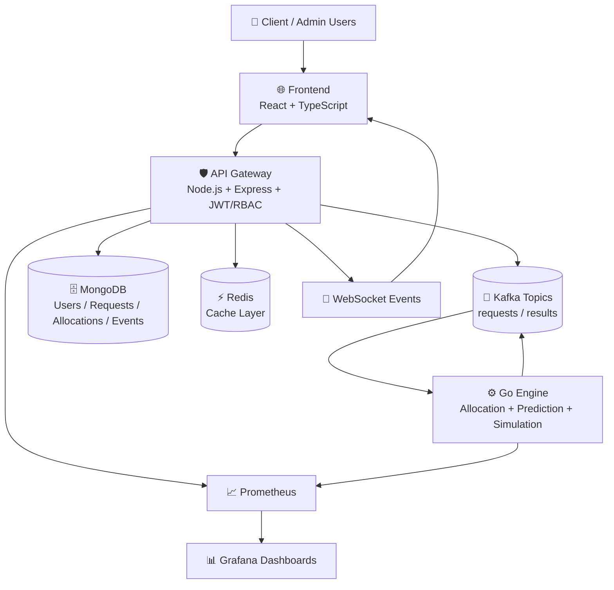

# 🚀 Schedulord — Enterprise Resource Orchestration Platform


<p align="left">
  <strong>AI-assisted allocation</strong> for GPU/CPU workloads with approval workflows, realtime visibility, and production-ready observability.
</p>

---

## ✨ At a Glance

Schedulord is a microservices platform that helps teams allocate compute resources safely and intelligently:

- 🧾 Users submit resource requests.
- 👩‍💼 Admins approve or reject requests with AI guidance.
- 🧠 Go Engine scores, predicts, and simulates allocation strategies.
- 📡 Events stream via Kafka, state persists in MongoDB, hot paths cache in Redis.
- 📊 Prometheus + Grafana provide operational transparency.

---

## 📚 Table of Contents

1. [Project Overview](#-project-overview)
2. [System Architecture](#-system-architecture)
3. [Tech Stack](#-tech-stack)
4. [AI/ML Models and Deep Learning Library](#-aiml-models-and-deep-learning-library)
5. [User Roles and Permissions](#-user-roles-and-permissions)
6. [API Endpoints](#-api-endpoints)
7. [Database Schema (Collections)](#-database-schema-collections)
8. [Demo Access Accounts](#-demo-access-accounts)
9. [Live Links](#-live-links)
10. [Quick Start](#-quick-start)
11. [Production Readiness Checklist](#-production-readiness-checklist)

---

## 📌 Project Overview

Schedulord is built for organizations that need **controlled, auditable, and intelligent** resource distribution.

Core capabilities:

- Role-based request lifecycle (create → review → approve/reject → allocate)
- AI-assisted decision support for prediction and simulation
- Resilient backend flow with fallback behavior
- Realtime updates and observability for operators

Typical workflow:

1. Client submits request (`resourceType`, `quantity`, `priority`, reviewer admin).
2. Request enters admin review queue.
3. On approval, processing pipeline triggers allocation logic.
4. Allocation + prediction + simulation outputs are persisted and surfaced in UI.
5. Metrics/events expose platform health and performance.

---

## 🏗️ System Architecture

```text
Frontend (React + TypeScript)
        ↓
API Gateway (Node.js + Express + JWT/RBAC + WebSockets)
        ↓
Kafka (request/result events)
        ↓
Go Engine (allocation + prediction + simulation)
        ↓
MongoDB (persistent state) + Redis (cache)
        ↓
Prometheus / Grafana (monitoring + dashboards)
```

### Rendered Architecture Diagram



---

## 🧰 Tech Stack

### Frontend

- React 19 + TypeScript
- Vite
- Tailwind CSS
- Redux Toolkit
- React Router
- Recharts
- Framer Motion
- Three.js (`@react-three/fiber`, `@react-three/drei`)
- Socket.IO client

### API Gateway

- Node.js + Express
- JWT authentication + RBAC middleware
- Joi + Zod request validation
- MongoDB via Mongoose
- Redis via ioredis
- Kafka via KafkaJS
- Socket.IO server
- Morgan + Pino logging
- Prometheus metrics (`prom-client`)

### Go Engine

- Go + Gin
- Allocation decision service
- Prediction and simulation handlers
- Prometheus exporter endpoints
- Kafka integration (consumer/producer patterns)

### Infrastructure

- Docker + Docker Compose
- Kafka + Zookeeper
- Prometheus
- Grafana

---

## 🧠 AI/ML Models and Deep Learning Library

Schedulord uses a **hybrid AI support pipeline** in:

- `backend/go-engine/internal/aisupport`

Training dataset:

- `schedulord_research_dataset_12000.csv`

### Model pipeline

1. **Logistic Regression** (feasibility score)  
   - Estimates probability that a request can be served now.

2. **Tree/Forest-style Predictor** (load score)  
   - Estimates near-term load pressure from request + system context.

3. **Neural Priority Scorer** (priority confidence)  
   - Small feed-forward neural network used in the composite decision output.

### Deep learning library used

- ✅ `gorgonia.org/gorgonia`
- ✅ `gorgonia.org/tensor`

These are used for the neural training/inference components in the Go ML pipeline.

### Model outputs exposed via API

Prediction and decision APIs surface fields such as:

- `feasibilityScore`
- `predictedLoad`
- `priorityScore`
- `aiScore`
- `recommendationScore`
- `decisionLog` (contains model trace metadata like `model_source=trained_dataset`)

### Training behavior

- Engine startup is dataset-driven and strict.
- If model training cannot initialize correctly, startup is designed to fail fast instead of silently degrading quality.

---

## 👥 User Roles and Permissions

Roles are enforced through JWT + `authenticateJWT` + `requireRole(...)`.

### `user` (Client)

- Login through client portal
- Create requests
- View own requests and outcomes
- Cancel allowed requests
- Access standard dashboard/resources/decision screens

### `admin`

- Login through admin portal
- Everything in `user`, plus:
  - Manage users
  - Manage resources
  - Approve/reject requests
  - Trigger manual allocation
  - Access admin decision queue/history
  - Access privileged analytics endpoints
  - Run administrative reset/maintenance endpoints

Security behavior:

- `401` for missing/invalid token
- `403` for role mismatch or forbidden actions

---

## 🔌 API Endpoints

Base URL: `http://localhost:8080/api`

### Health & Metrics

| Method | Path | Auth | Description |
|---|---|---|---|
| GET | `/health` (outside `/api`) | No | API gateway health check |
| GET | `/metrics` (outside `/api`) | No | API gateway Prometheus metrics |

### Auth

| Method | Path | Auth | Description |
|---|---|---|---|
| POST | `/auth/register` | No | Register client user |
| POST | `/auth/login` | No | Login with `intendedRole` |

### Users

| Method | Path | Auth | Role | Description |
|---|---|---|---|---|
| GET | `/users/me` | Yes | user/admin | Current user |
| GET | `/users/admins` | Yes | user/admin | Reviewer admin list |
| GET | `/users` | Yes | admin | List users |
| POST | `/users` | Yes | admin | Create user/admin |
| PATCH | `/users/:id` | Yes | admin | Update role/status |

### Resources

| Method | Path | Auth | Role | Description |
|---|---|---|---|---|
| GET | `/resources` | Yes | user/admin | List resources |
| GET | `/resources/:id` | Yes | user/admin | Resource details |
| POST | `/resources` | Yes | admin | Create resource |
| PATCH | `/resources/:id` | Yes | admin | Update resource |
| DELETE | `/resources/:id` | Yes | admin | Delete resource |

### Requests

| Method | Path | Auth | Role | Description |
|---|---|---|---|---|
| GET | `/requests` | Yes | user/admin | List requests (scoped) |
| GET | `/requests/decisions/me` | Yes | admin | Admin decision queue/history |
| GET | `/requests/:id` | Yes | user/admin | Request detail |
| POST | `/requests` | Yes | user | Create request |
| POST | `/requests/:id/cancel` | Yes | user/admin | Cancel request |
| POST | `/requests/:id/allocate` | Yes | admin | Manual allocation |
| POST | `/requests/:id/approve` | Yes | admin | Approve request |
| POST | `/requests/:id/reject` | Yes | admin | Reject request |
| POST | `/requests/clear` | Yes | admin | Clear requests (admin utility) |

### Analytics

| Method | Path | Auth | Role | Description |
|---|---|---|---|---|
| GET | `/analytics/dashboard` | Yes | user/admin | Dashboard stats |
| GET | `/analytics/utilization` | Yes | user/admin | Utilization metrics |
| GET | `/analytics/demand-trends` | Yes | admin | Demand trend series |
| GET | `/analytics/allocations` | Yes | user/admin | Allocation metrics |
| GET | `/analytics/events` | Yes | user/admin | Event feed |
| GET | `/analytics/predict` | Yes | user/admin | Prediction proxy |
| GET | `/analytics/simulate` | Yes | user/admin | Simulation proxy |
| GET | `/analytics/engine-health` | Yes | admin | Go engine health via gateway |

### Go Engine Direct Endpoints

Base URL (direct): usually `http://localhost:9095` locally

| Method | Path | Description |
|---|---|---|
| GET | `/healthz` | Go engine health |
| POST | `/process` | Process allocation payload |
| GET | `/predict` | Prediction output |
| GET | `/simulate` | Simulation output |
| GET | `/learning/stats` | Learning stats |
| GET | `/metrics` | Prometheus metrics |

---

## 🗄️ Database Schema (Collections)

### `users`
- `name: String`
- `email: String` (unique, indexed)
- `passwordHash: String` (hidden by default)
- `role: "admin" | "user"` (indexed)
- `isActive: Boolean` (indexed)
- timestamps

### `resources`
- `name: String` (indexed)
- `type: String` (indexed)
- `capacity: Number`
- `metadata: Object`
- `isAvailable: Boolean` (indexed)
- timestamps

### `requests`
- `userId: ObjectId<User>` (indexed)
- `reviewerAdminId: ObjectId<User>` (indexed)
- `resourceType: String` (indexed)
- `preferredResourceId: ObjectId<Resource> | null` (indexed)
- `quantity: Number`
- `priority: Number` (0..100, indexed)
- `status: pending | processing | allocated | rejected | cancelled` (indexed)
- `reason: String`
- `adminApproved: Boolean` (indexed)
- `kafkaApprovedPublished: Boolean` (indexed)
- lease fields: `processingBy`, `processingLeaseUntil`, `attempts`, `lastAttemptAt`
- Kafka tracking: `kafkaOffset`, `kafkaPartition`
- `idempotencyKey: String` (partial unique index with `userId`)
- timestamps

### `allocations`
- `requestId: ObjectId<Request>` (unique index)
- `resourceId: ObjectId<Resource>` (indexed)
- `decidedBy: "go-engine" | "manual"` (indexed)
- `score: Number`
- `confidence: Number` (0..1)
- `strategy: String`
- `alternatives: Array`
- `details: Object`
- timestamps

### `systemevents`
- `type: allocation | conflict | prediction | system | error | simulation` (indexed)
- `severity: info | warning | error | critical` (indexed)
- `title: String`
- `message: String`
- `metadata: Object`
- `requestId: ObjectId<Request>` (indexed)
- `resourceId: ObjectId<Resource>` (indexed)
- `userId: ObjectId<User>` (indexed)
- timestamps
- TTL index on `createdAt` (~30 days)

### `auditlogs`
- `actorUserId: ObjectId<User>` (indexed)
- `action: String` (indexed)
- `entityType: String` (indexed)
- `entityId: String` (indexed)
- `ip: String`
- `userAgent: String`
- `details: Object`
- timestamps

---

## 🔐 Demo Access Accounts

### Bootstrap Admin (auto-seeded)

If not already present, the API gateway seeds:

- **Email:** `admin@schedulord.local`
- **Password:** `ChangeMe123!`
- **Role:** `admin`

Configurable with:

- `BOOTSTRAP_ADMIN_EMAIL`
- `BOOTSTRAP_ADMIN_PASSWORD`

### Demo Client/User

No guaranteed pre-seeded client is enforced by default.

Create one via:

- `POST /api/auth/register`

Then login using:

- `/login/client` (UI), or
- `POST /api/auth/login` with `intendedRole: "user"`

---

## ✅ Completion Status

- **System Completed:** Schedulord core components implemented and pushed to GitHub on 2026-05-09.
- **Repository:** https://github.com/MUKILAN0608/Schedulord


> ⚠️ Rotate demo credentials before any real deployment.

---

## 🌐 Live Links

### Local Development

- Frontend: [http://localhost:3001](http://localhost:3001)
- API Gateway: [http://localhost:8080](http://localhost:8080)
- API Metrics: [http://localhost:8080/metrics](http://localhost:8080/metrics)
- Go Engine Health: [http://localhost:9095/healthz](http://localhost:9095/healthz)
- Go Engine Metrics: [http://localhost:9095/metrics](http://localhost:9095/metrics)
- Grafana: [http://localhost:3000](http://localhost:3000)
- Prometheus: [http://localhost:9091](http://localhost:9091)

### Docker Compose Defaults

- API Gateway: [http://localhost:8081](http://localhost:8081)
- Go Engine: [http://localhost:9090](http://localhost:9090)

> Use your actual mapped ports if they differ by environment.

### Production (replace placeholders)

- Frontend: `https://<your-frontend-domain>`
- API: `https://<your-api-domain>`
- Grafana: `https://<your-grafana-domain>`
- Prometheus: `https://<your-prometheus-domain>`

---

## ⚡ Quick Start

```bash
docker compose up --build
```

Manual local start:

- `frontend`: `npm run dev`
- `backend/api-gateway`: `npm run dev`
- `backend/go-engine`: `go run ./cmd/main.go`

---

## ✅ Production Readiness Checklist

- [ ] Frontend build passes (`npm run build`)
- [ ] API lint passes (`npm run lint`)
- [ ] Go engine command and health endpoints are green
- [ ] Auth flow works for both roles (`admin`, `user`)
- [ ] Prediction and simulation endpoints return valid payloads
- [ ] Prometheus targets are UP
- [ ] Grafana dashboard panels render live data
- [ ] Demo/default credentials are rotated
- [ ] Environment secrets are injected securely (no plain defaults)
